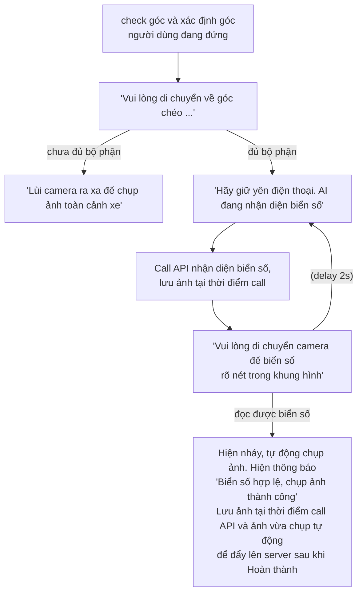
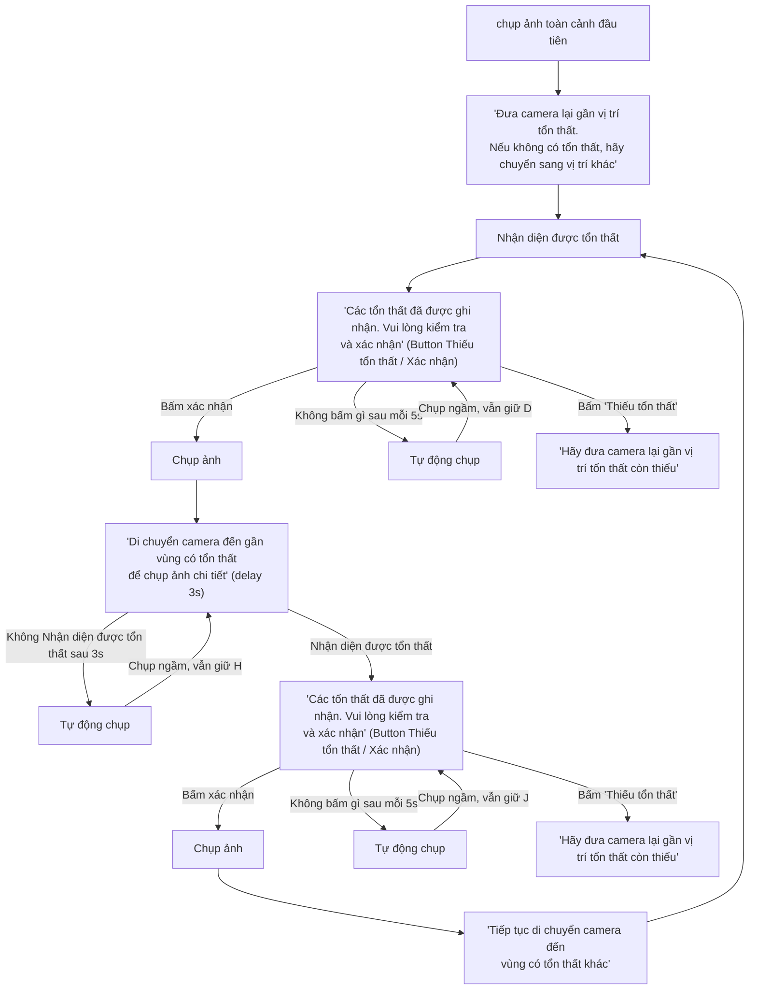
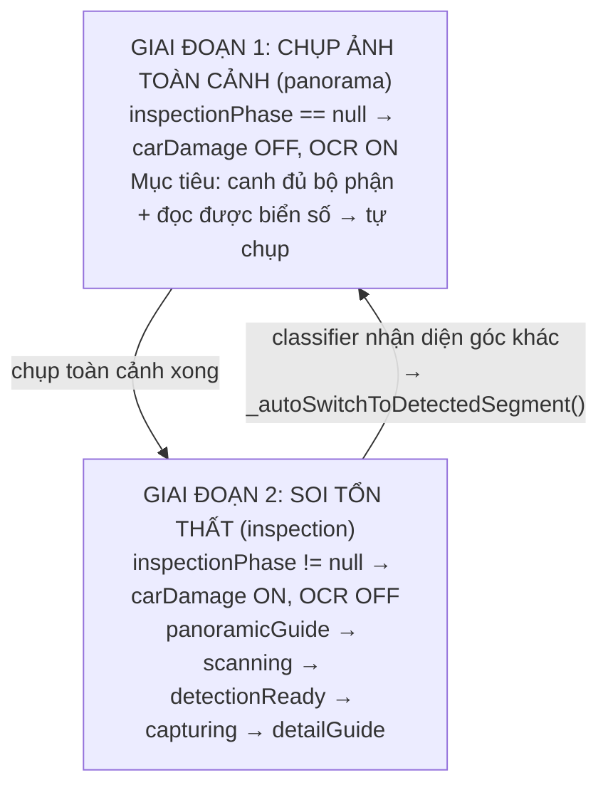
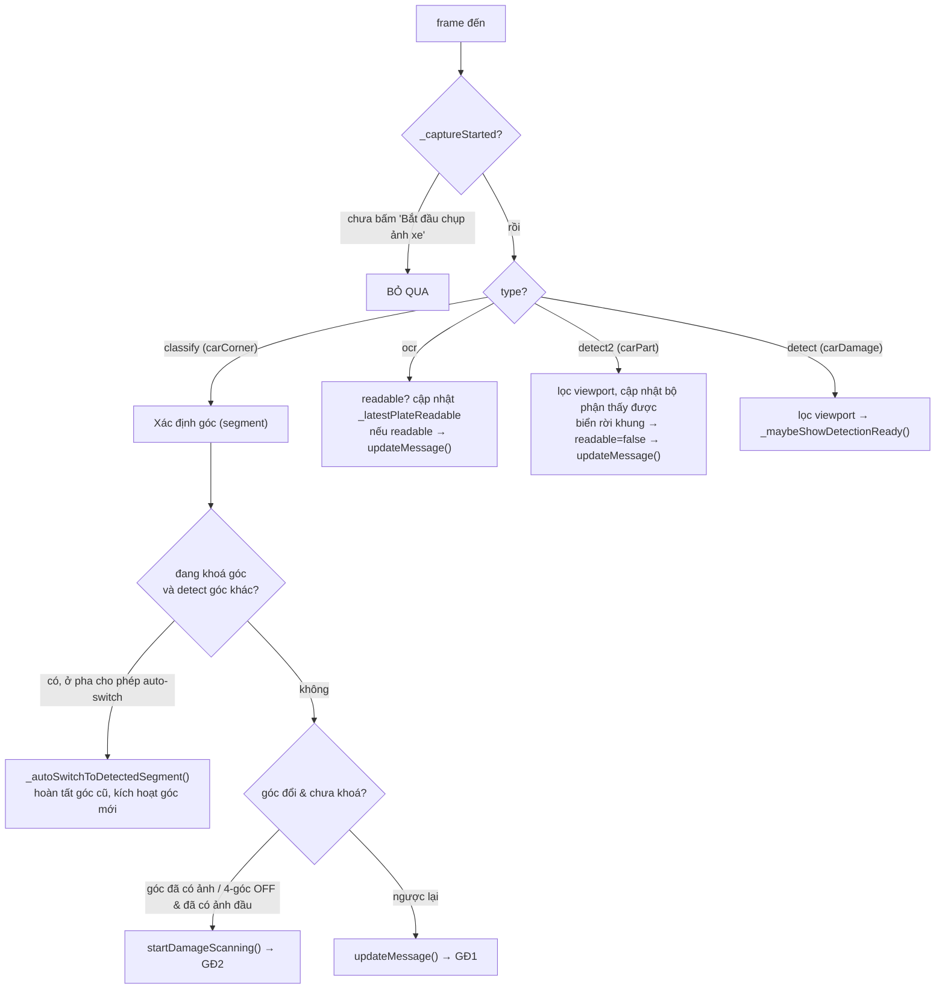
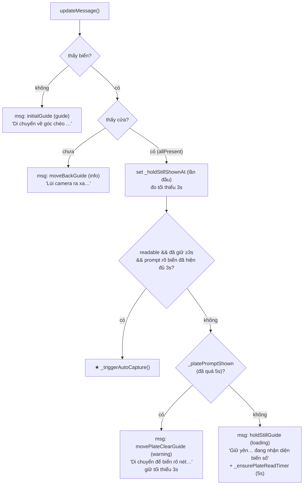
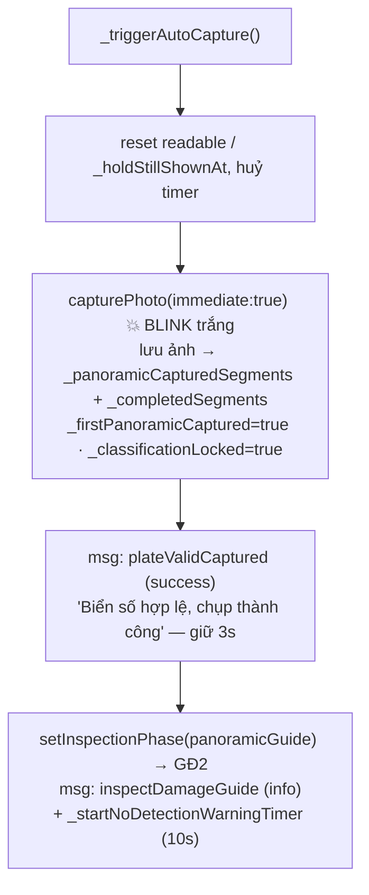
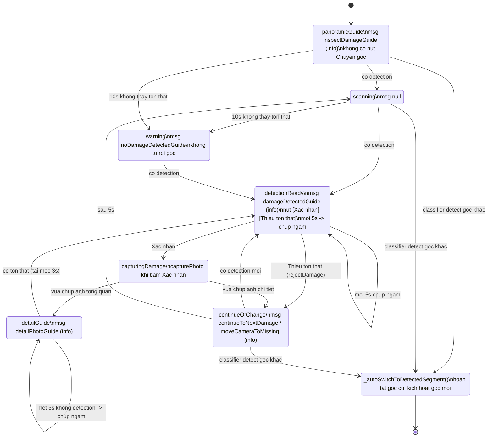
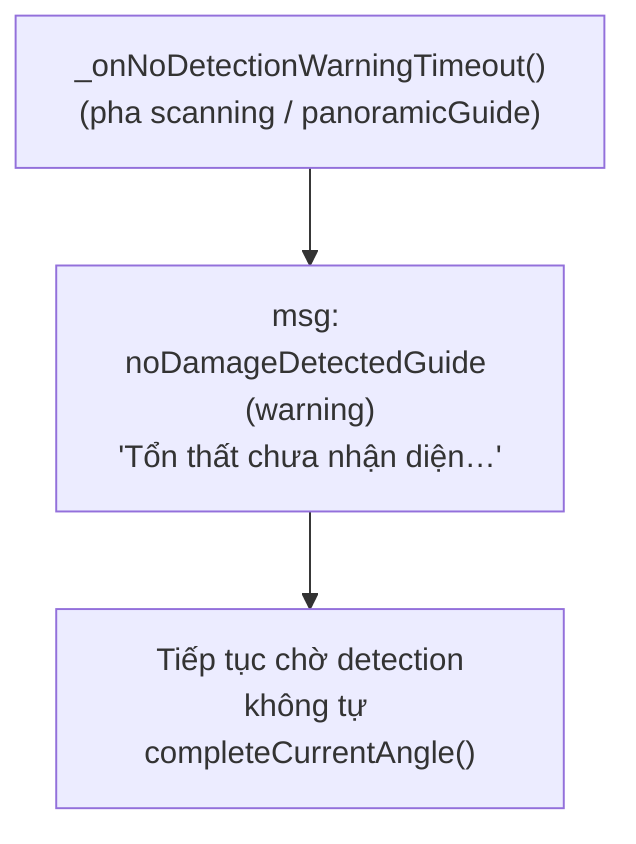
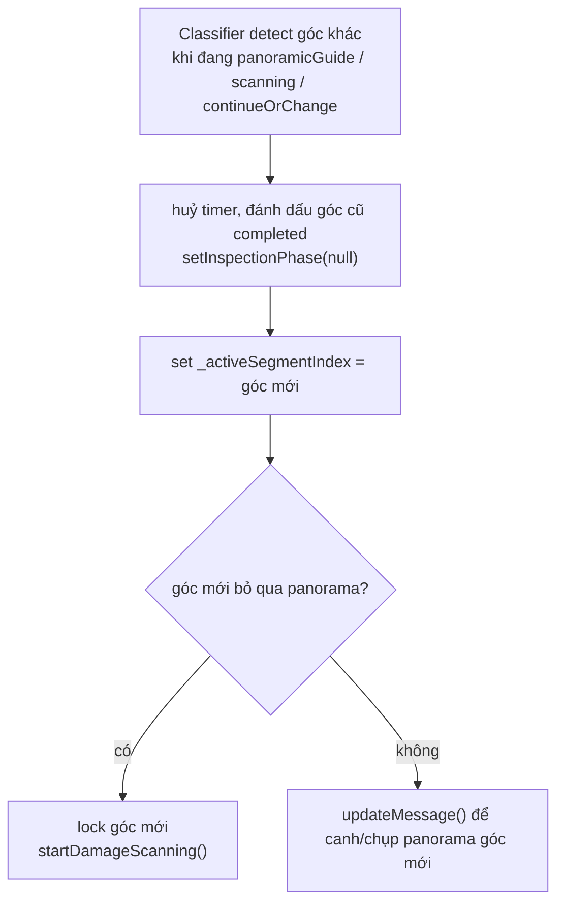

# Luồng chụp ảnh — `CameraController`

Tài liệu mô tả máy trạng thái chụp ảnh trong
[`camera_controller.dart`](lib/src/features/camera/presentation/controller/camera_controller.dart),
bao gồm cả message hiển thị (`_setMessage`) theo từng bước.

Mọi message hiển thị qua `_setMessage(CameraMessage(message, type))`. `type`
quyết định màu/icon tooltip: `guide / info / warning / loading / success`.

---

## Sơ đồ thiết kế tổng thể (bản vẽ)

### Bản vẽ 1 — Giai đoạn chụp ảnh toàn cảnh (đọc biển số)

### Bản vẽ 2 — Giai đoạn soi tổn thất (overview + chi tiết)

> 2 sơ đồ trên đang phản ánh flow theo feedback mới của khách. Một vài chi tiết
> được nói rõ hơn / khác với bản vẽ ban đầu: OCR biển số chạy **on-device**
> (không phải "call API"); delay giữ yên hiện là **3s** (không phải 2s).
> Phần dưới mô tả đúng theo code.

---

## Tổng quan: 2 giai đoạn lớn

---

## Cổng vào: `onStreamingData(frame)`

Mỗi frame YOLO (~30fps) được phân loại theo `type` / `modelId`:

---

## GIAI ĐOẠN 1 — `updateMessage()` (canh khung + đọc biển)

Chỉ chạy khi `inspectionPhase == null`.

- `hasPlate` = thấy "Biển số xe"
- `allPresent` = thấy Biển + Cửa + Cản trước

### `_triggerAutoCapture()` ★ — chụp ảnh toàn cảnh

---

## GIAI ĐOẠN 2 — Soi tổn thất (máy trạng thái `InspectionPhase`)

### 10s không thấy tổn thất — warning-only

### Tự động chuyển góc — `_autoSwitchToDetectedSegment()`

---

## Bảng message ↔ type ↔ ngữ cảnh

| Message (StringSheet) | type | Khi nào |
|---|---|---|
| `*Guide` (frontLeft/Right…) | guide | GĐ1: chưa thấy biển / điều hướng góc |
| `moveBackGuide` | info | GĐ1: thấy biển, chưa thấy cửa |
| `holdStillGuide` | loading | GĐ1: đủ bộ phận, đang đọc biển (≥3s mới chụp) |
| `movePlateClearGuide` | warning | GĐ1: quá 5s chưa đọc được biển |
| `plateValidCaptured` | success | Chụp toàn cảnh xong (giữ 3s) |
| `inspectDamageGuide` | info | Vào panoramicGuide |
| `damageDetectedGuide` | info | detectionReady |
| `moveCameraToMissing` | info | Bấm "Thiếu tổn thất" |
| `detailPhotoGuide` | info | detailGuide |
| `continueToNextDamage` | info | Sau khi user xác nhận ảnh chi tiết |
| `noDamageDetectedGuide` | warning | 10s không thấy tổn thất (chỉ cảnh báo, không tự rời góc) |
| `null` | — | scanning, hoặc rời góc (4-góc TẮT / đã đủ góc) |

---

## Các điểm chụp ảnh & blink

| Đường chụp | Lệnh | Blink? |
|---|---|---|
| Toàn cảnh từ biển số | `capturePhoto(immediate:true)` | ✅ |
| Thủ công (nút shutter) | `capturePhoto(immediate:true)` | ✅ |
| Xác nhận tổn thất (bấm tay) | `capturePhoto(immediate:true, flashTick:true)` | ✅ |
| Auto-chụp ngầm mỗi 5s khi đang xác nhận tổn thất | `capturePhoto(immediate:true, flashTick:false)` | ❌ (cố ý) |
| Auto-chụp ảnh chi tiết mỗi 3s khi detailGuide không có detection | `capturePhoto(immediate:true, flashTick:false)` | ❌ (cố ý) |

> Blink được vẽ **ngay trước** lệnh native capture (`notifyListeners()` sau khi
> tăng `_captureFlashTick`) để đồng bộ đúng khoảnh khắc chụp.

---

## Ghi chú gating OCR (canh khung biển số)

- Ảnh toàn cảnh được crop theo viewport preview dưới aspect-fill. Native tính lại
  crop rect normalized chính xác như `capturePhoto`, bao gồm offset do cover/crop.
- OCR chỉ coi là "đọc được biển" khi toàn bộ bbox biển số nằm trong crop rect đó
  sau khi inset margin an toàn ở cả 2 trục. Nhờ vậy biển số đọc được nhưng bị lẹm
  ở mép ảnh crop sẽ không được dùng để xác nhận ảnh toàn cảnh hợp lệ.
