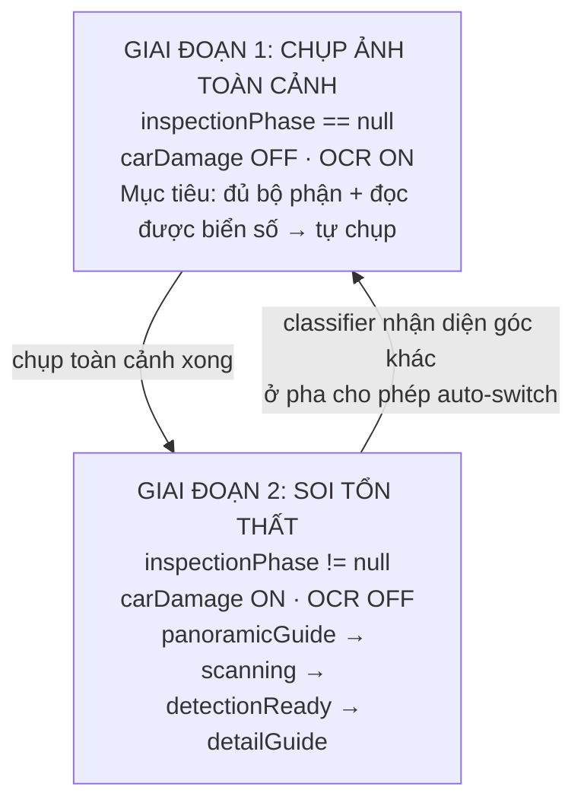
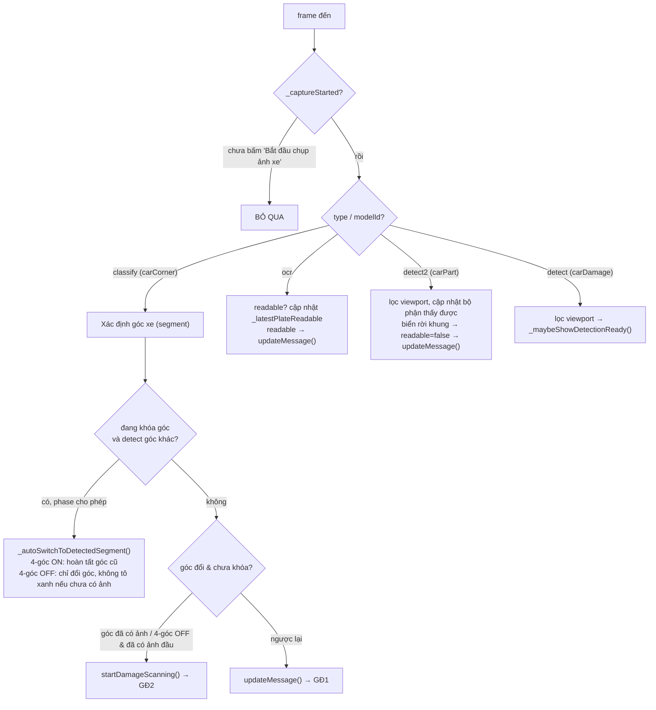
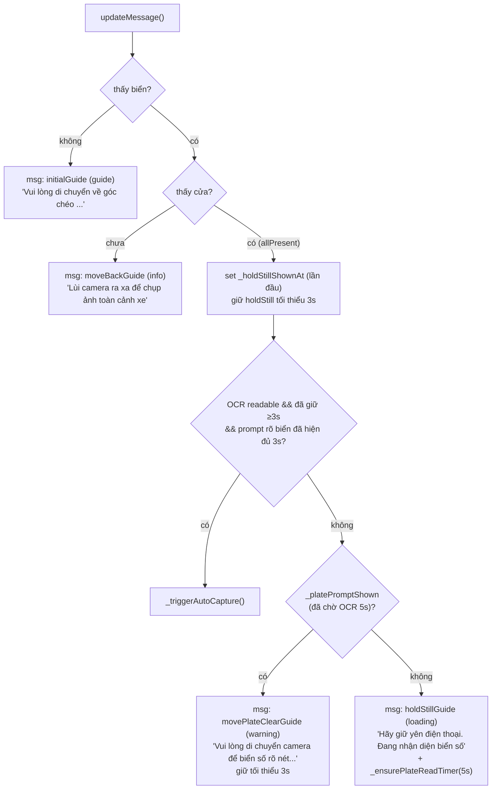
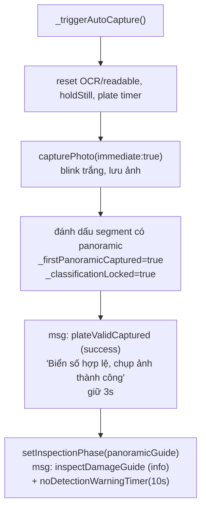
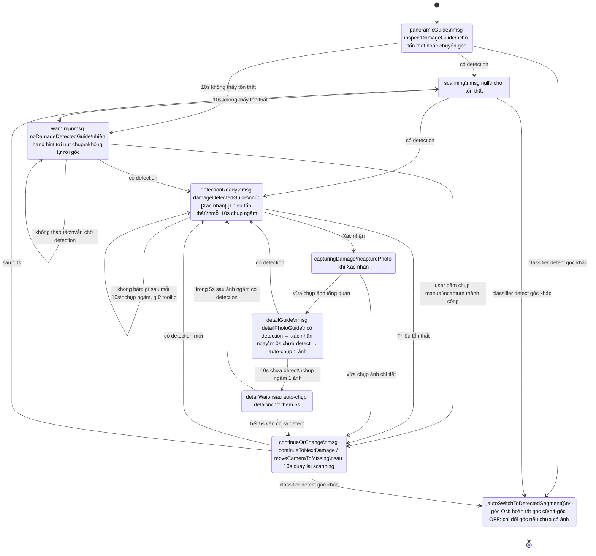
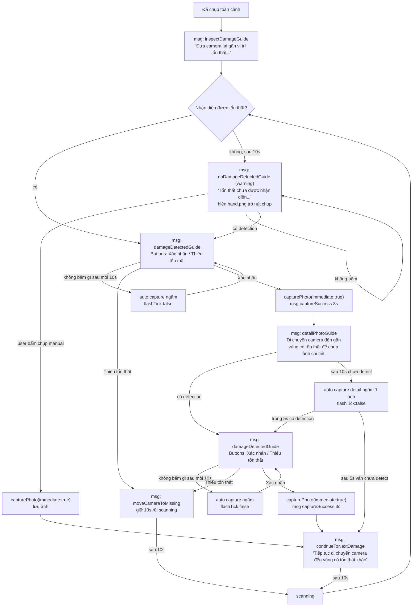
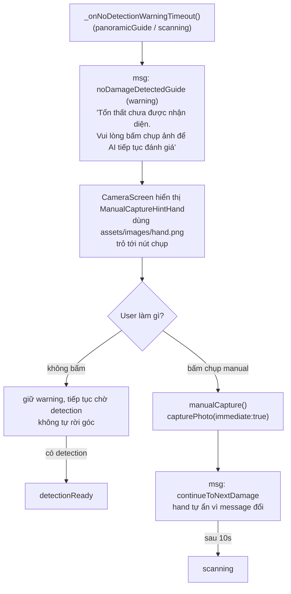
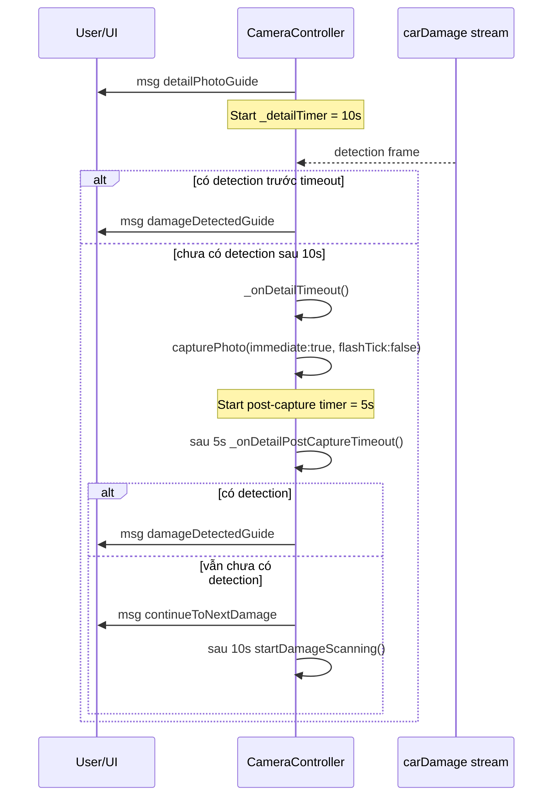
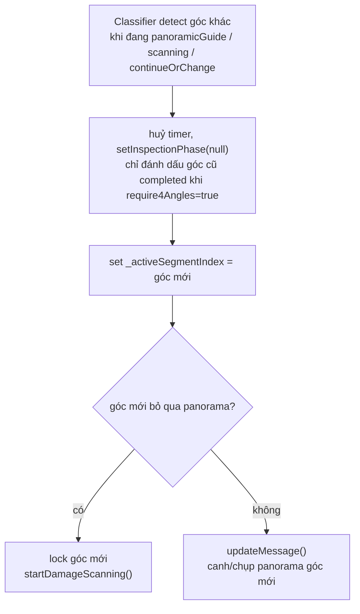

# Luồng chụp ảnh — `CameraController`

Tài liệu mô tả máy trạng thái chụp ảnh trong
[`camera_controller.dart`](lib/src/features/camera/presentation/controller/camera_controller.dart),
bao gồm cả message hiển thị (`_setMessage`) theo từng bước.

Mọi message hiển thị qua `_setMessage(CameraMessage(message, type))`. `type`
quyết định màu/icon tooltip: `guide / info / warning / loading / success`.
Tooltip đã hiển thị sẽ được giữ tối thiểu **3s** trước khi message/phase khác
được phép thay thế. Ngoại lệ: message phản hồi một sự kiện vừa xảy ra có thể
dùng `_setMessage(..., immediate: true)` để hiển thị ngay, ví dụ chụp thành
công và điều hướng sau thao tác của người dùng.

---

## Tổng quan: 2 giai đoạn lớn

---

## Cổng vào: `onStreamingData(frame)`

Mỗi frame YOLO được phân loại theo `type` / `modelId`:

---

## GIAI ĐOẠN 1 — Chụp ảnh toàn cảnh

Chỉ chạy khi `inspectionPhase == null`.

- `hasPlate` = thấy class `"Biển số xe"`
- `allPresent` = thấy Biển + Cửa + Cản trước theo góc hiện tại

### `_triggerAutoCapture()` — ảnh toàn cảnh

---

## GIAI ĐOẠN 2 — Soi tổn thất

### State machine chính

### Flow overview + ảnh chi tiết

### Warning 10s không thấy tổn thất + hand hint

### Detail guide theo feedback khách

### Tự động chuyển góc — `_autoSwitchToDetectedSegment()`

---

## Bảng message ↔ type ↔ ngữ cảnh

| Message (StringSheet) | type | Khi nào |
|---|---|---|
| `*Guide` (`frontLeftGuide`, `frontRightGuide`, ...) | guide | GĐ1: chưa thấy biển / điều hướng góc |
| `moveBackGuide` | info | GĐ1: thấy biển, chưa thấy cửa |
| `holdStillGuide` | loading | GĐ1: đủ bộ phận, đang đọc biển; giữ ≥3s mới chụp |
| `movePlateClearGuide` | warning | GĐ1: quá 5s chưa đọc được biển; giữ warning ≥3s |
| `plateValidCaptured` | success | Chụp toàn cảnh xong; giữ 3s |
| `inspectDamageGuide` | info | Vào `panoramicGuide` |
| `damageDetectedGuide` | info | `detectionReady`, có nút `Xác nhận` / `Thiếu tổn thất` |
| `moveCameraToMissing` | info | User bấm `Thiếu tổn thất`; giữ 10s rồi quét lại |
| `detailPhotoGuide` | info | Sau khi xác nhận ảnh tổng quan; có detection thì mở xác nhận ngay, không detect sau 10s thì auto-chụp ảnh chi tiết |
| `continueToNextDamage` | info | Sau khi xác nhận ảnh chi tiết, sau manual capture từ warning, hoặc detailGuide 10s + 5s vẫn không detect |
| `noDamageDetectedGuide` | warning | 10s không thấy tổn thất ở `panoramicGuide` / `scanning`; hiện hand hint |
| `null` | — | `scanning`, hoặc rời góc (4-góc OFF / đã đủ góc) |

---

## Các điểm chụp ảnh & blink

| Đường chụp | Lệnh | Blink? | Ghi chú |
|---|---|---|---|
| Toàn cảnh từ biển số | `capturePhoto(immediate:true)` | Có | Sau khi OCR readable và giữ khung đủ 3s |
| Thủ công (nút shutter) | `capturePhoto(immediate:true)` | Có | Nếu đang ở `noDamageDetectedGuide`, capture xong chuyển `continueToNextDamage` |
| Xác nhận tổn thất (bấm tay) | `capturePhoto(immediate:true, flashTick:true)` | Có | Sau ảnh tổng quan → `detailGuide`; sau ảnh chi tiết → `continueToNextDamage` |
| Auto-chụp ngầm khi đang xác nhận tổn thất | `capturePhoto(immediate:true, flashTick:false)` | Không | Mỗi 10s khi user không bấm gì, vẫn giữ `damageDetectedGuide` |
| Auto-chụp ảnh chi tiết | `capturePhoto(immediate:true, flashTick:false)` | Không | Một lần sau 10s ở `detailGuide` nếu chưa detect; sau đó chờ thêm 5s |

Blink được vẽ ngay trước lệnh native capture (`notifyListeners()` sau khi tăng
`_captureFlashTick`) để đồng bộ đúng khoảnh khắc chụp.

---

## Ghi chú gating OCR (canh khung biển số)

- Ảnh toàn cảnh được crop theo viewport preview dưới aspect-fill. Native tính lại
  crop rect normalized chính xác như `capturePhoto`, bao gồm offset do cover/crop.
- OCR chỉ coi là "đọc được biển" khi toàn bộ bbox biển số nằm trong crop rect đó
  sau khi inset margin an toàn ở cả 2 trục. Nhờ vậy biển số đọc được nhưng bị lẹm
  ở mép ảnh crop sẽ không được dùng để xác nhận ảnh toàn cảnh hợp lệ.
